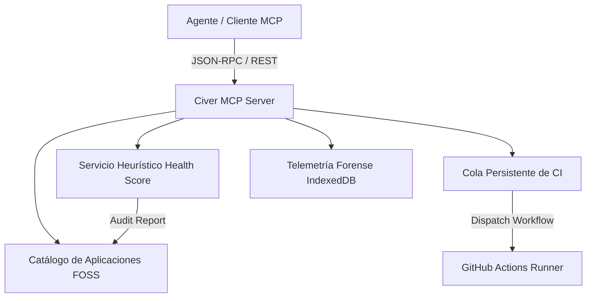

# Civer App Store - Agent Integration & Architecture Guide

Bienvenido al manual de referencia integral para agentes y desarrolladores que interactúan con **Civer App Store Matrix**. Este documento detalla la arquitectura del sistema, los contratos de comunicación, las herramientas MCP y los flujos de trabajo automatizados.

---

## 1. Visión General del Sistema

Civer App Store es una plataforma de compilación, auditoría y distribución de software libre (FOSS) para Android que unifica:
- Catálogo de tiendas y herramientas FOSS auditadas.
- Compilador automatizado con integración GitHub Actions CI.
- Motor heurístico de evaluación de salud de repositorios (`Health Score`).
- Cola de compilaciones persistente localmente en el cliente con reintentos automáticos.
- Bus de eventos WebSocket simulado y telemetría de resiliencia en IndexedDB.



---

## 2. Herramientas MCP Disponibles (Model Context Protocol)

El manifiesto de herramientas MCP se encuentra exportado en `src/services/mcpToolsService.ts` bajo el esquema oficial de MCP.

### Herramientas Principales:
1. `list_catalog_apps`: Consulta el catálogo completo de aplicaciones FOSS con filtros por categoría, puntuación de salud y arquitectura binaria.
2. `analyze_repo_heuristics`: Analiza un repositorio de GitHub y calcula su `Health Score` (0-100%) evaluando Gradle Wrapper, Kotlin DSL y cadencia de commits.
3. `enqueue_ci_build`: Encola una compilación en la cola persistente con prioridades (`CRITICAL`, `HIGH`, `NORMAL`, `LOW`) y política de reintentos.
4. `get_ci_queue_status`: Monitorea el progreso de los trabajos en la cola de compilación.
5. `get_fault_telemetry`: Inspecciona registros forenses de incidentes en IndexedDB.
6. `sync_fdroid_mirrors`: Dispara sincronización diferencial con espejos de F-Droid V2.

---

## 3. Estructura de Almacenamiento Local y Persistencia

El cliente utiliza almacenamiento local seguro y tolerante a fallos:
- **IndexedDB (`civer_fault_telemetry_db`)**: Almacena trazas forenses de errores de red, fallos de compilación y excepciones no controladas.
- **LocalStorage (`civer_persistent_ci_queue_v1`)**: Almacena el estado íntegro de la cola de compilación con sus logs e intentos.
- **LocalStorage (`civer_active_profile`)**: Datos del perfil de usuario y preferencias.

---

## 4. Flujo de Ejecución en Entorno Local

Para ejecutar y controlar la plataforma desde tu entorno local una vez exportado el proyecto:

```bash
# 1. Instalar dependencias
npm install

# 2. Iniciar servidor de desarrollo en puerto 3000
npm run dev

# 3. Compilar para producción
npm run build
```

---

## 5. Contratos de API y RPC

- **OpenAPI 3.1:** Disponible en `src/components/RepoIndexSyncModal.tsx` bajo la pestaña de API Specification.
- **Protocol Buffers (`civer.store.v1`):** Definición binaria para gRPC disponible en la misma interfaz de sincronización de repositorios.
