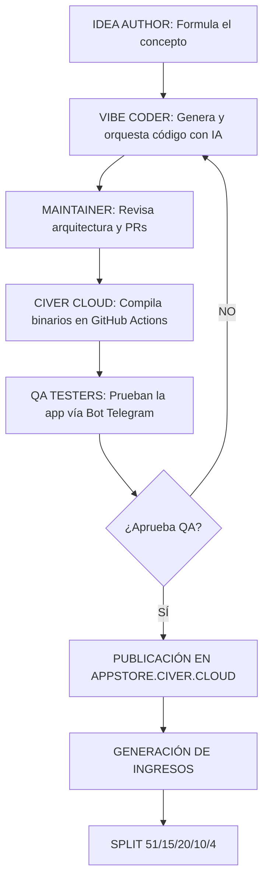

# PITCH DECK EJECUTIVO - CIVER APP STORE

> "La Play Store Open Source, Tu trabajo en línea que sí paga"

Este documento representa la versión ejecutiva del modelo de negocio, producto, métricas y proyecciones de Civer App Store, diseñado específicamente para potenciales socios estratégicos, fundaciones FOSS e Inversionistas de Impacto Social.

---

## SLIDE 1: PORTADA

```text
       _____  ___  __   __  ___   ___   
      / ___/ /_ /  \ \ / / /_ /  / _ \  
     / /__    / /    \ V /  / /_  / , _/  
     \___/  /___/    \_/  /___/ /_/|_|   
          C L O U D   E N T E R P R I S E
```

**Civer App Store**
"La Play Store Open Source, Tu trabajo en línea que sí paga"
*Presentado por: Equipo Directivo de Civer Cloud*
*Dominio de producción:* https://appstore.civer.cloud

---

## SLIDE 2: EL PROBLEMA

El ecosistema actual de distribución de software móvil está centralizado, es monopólico, extractivo y altamente perjudicial tanto para creadores como para usuarios finales.

1.  **El "Google Tax" (Comisión del 30%):** Google Play y Apple App Store extraen el 30% de los ingresos de los creadores por el simple hecho de alojar sus aplicaciones. Es un peaje monopólico que destruye la rentabilidad de desarrolladores independientes.
2.  **Violación Masiva de Privacidad:** Estudios de la industria (2026) demuestran que más del **85% de las aplicaciones comerciales** contienen rastreadores ocultos (SDKs de telemetría de terceros, publicidad, analítica en la sombra) sin el consentimiento explícito del usuario.
3.  **Falta de Herramientas para "No Coders":** No existe un marketplace integral y guiado por IA donde personas sin experiencia técnica (Idea Authors) puedan generar aplicaciones nativas completas y rentabilizarlas.
4.  **Explotación en el Testing:** Los testers de aplicaciones en plataformas como uTest son precarizados, compitiendo en "carreras a la baja" por pagos mínimos, sin participación a largo plazo en el éxito del producto (sin regalías).

---

## SLIDE 3: LA SOLUCIÓN CIVER

Civer App Store rompe el monopolio mediante un modelo dual: un ecosistema técnico impulsado por Inteligencia Artificial de vanguardia y un modelo de negocio similar a una "Disquera Digital".

1.  **La Play Store Open Source:** Un repositorio seguro, auditable y descentralizado, respaldado por compilación Cloud real (GitHub Actions).
2.  **IA Ilimitada (Vibe Coding):** Nuestra suite propietaria (OmniRoute + DeepSeek Harness + OpenClaw 2.0) permite a cualquier persona dictar sus requerimientos (Idea) y generar aplicaciones funcionales y seguras en cuestión de horas.
3.  **Marketplace de Trabajo Justo:** Implementamos un contrato inteligente (legal y técnico) de regalías vitalicias (Royalties). Todo colaborador gana de manera perpetua.
4.  **Promesa al Usuario Final:**
    *   **0% Google Tax:** 100% de la ganancia va al ecosistema Civer.
    *   **0 Rastreadores (Zero Tracking):** Auditoría estricta, cada binario es validado.
    *   **100% Transparente:** Todo el código fuente está disponible.

---

## SLIDE 4: CÓMO FUNCIONA (EL FLUJO)

El ciclo de vida del producto en Civer Cloud está optimizado y altamente paralelizado.



*   **Paso 1:** El Idea Author somete su propuesta al sistema.
*   **Paso 2:** Los agentes IA (OmniRoute) y los Vibe Coders transforman la idea en código fuente.
*   **Paso 3:** La infraestructura Cloud compila automáticamente las aplicaciones a APK.
*   **Paso 4:** El Bot de Telegram (@EnviodeApkCompiladaBot) distribuye el binario a los QA Testers.
*   **Paso 5:** Aprobada la calidad, se lanza a la App Store y se detonan los contratos de distribución de ganancias vía Lightning Network o SPEI.

---

## SLIDE 5: MODELO DE NEGOCIO Y "UNIT ECONOMICS"

Civer Cloud Enterprise funciona bajo un modelo "Disquera Digital" (Record Label). Nosotros proveemos la infraestructura, la IA, y los contratos; a cambio de ser dueños de la IP y distribuir regalías.

**Estructura del Split de Ingresos (Royalty Distribution):**
*   **51% - Civer Cloud Enterprise:** (Cubre hosting en DigitalOcean, CDN en Cloudflare, GPUs en Kaggle/Baseten, gastos operativos).
*   **20% - Vibe Coder:** El orquestador de la IA.
*   **15% - Idea Author:** El creador del concepto y la visión.
*   **10% - Lead Maintainer:** Quien supervisa y hace merge del código.
*   **4%  - QA Testers Pool:** Dividido entre los probadores iniciales que certificaron la app.

**Fuentes de Ingreso (Revenue Streams):**
1.  Venta directa de apps (Premium).
2.  Suscripciones In-App procesadas fuera del monopolio de Google.
3.  Servicios de consultoría "Enterprise" de Vibe Coding.
4.  Certificación de "Zero Tracking" para terceros.
5.  Hardware Integrado (Futuro).
6.  Donaciones FOSS.

---

## SLIDE 6: MERCADO (TAM, SAM, SOM)

Operamos en la intersección de tres mercados masivos: la Economía de las Apps, el Desarrollo Asistido por IA y el Mercado Laboral Freelance.

*   **TAM (Total Addressable Market) - $200 Billones USD:** El tamaño global estimado del mercado de distribución de aplicaciones móviles (App Economy).
*   **SAM (Serviceable Available Market) - $5 Billones USD:** El mercado de tiendas de aplicaciones alternativas (Third-party App Stores), software Open Source y plataformas de crowd testing global.
*   **SOM (Serviceable Obtainable Market) - $50 Millones USD (a 5 años):** Nuestro objetivo en el mercado Latinoamericano enfocado en el nicho FOSS (Free Open Source Software) y el marketplace de trabajo para testers y coders en países en desarrollo.

---

## SLIDE 7: TRACCIÓN ACTUAL

Nuestra ejecución técnica avala nuestra visión. Hoy en día no vendemos promesas, vendemos un ecosistema productivo.

*   **Catálogo:** Más de 25 aplicaciones curadas, compiladas y listas en la plataforma.
*   **Infraestructura Operativa (6 Pilares):**
    1.  Compilación Cloud Nativa (GitHub Actions CI/CD).
    2.  Edge Delivery (Cloudflare CDN operando).
    3.  Backend Serverless (DigitalOcean Gateway).
    4.  IA Inferencia local y remota (Kaggle/Baseten + GPU ROG/ThinkPad).
    5.  Suite de IA (OmniRoute + DeepSeek Harness).
    6.  Distribución Autónoma (Telegram Bot @EnviodeApkCompiladaBot).
*   **Comunidad:** 4 proyectos activos bajo el modelo "Shark Tank".
*   **Producción:** Dominio principal vivo: *https://appstore.civer.cloud*.

---

## SLIDE 8: ANÁLISIS DE COMPETENCIA

¿Por qué Civer desplaza a las soluciones actuales?

+--------------------+---------------+-----------------+------------------+-----------------+
| Característica     | Civer Store   | Google Play     | F-Droid          | uTest / Toptal  |
+--------------------+---------------+-----------------+------------------+-----------------+
| Enfoque Principal  | Disquera IP   | Monopolio App   | Repositorio FOSS | Testing Freelance|
| Comisión (Tax)     | 0% Extra Tax  | 15% - 30%       | 0% (Gratis solo) | Hasta 20%       |
| Creación con IA    | Nativa, Guíada| No Existe       | No Existe        | No Existe       |
| Tracking / Privacy | Cero Rastread.| 85% Apps track. | Auditoría estric.| N/A             |
| Regalías a Testers | 4% Vitalicio  | 0%              | 0%               | 0% (Pago Único) |
| Método de Pago     | Lightning/SPEI| Banco (Tardado) | N/A              | PayPal / Payoneer|
+--------------------+---------------+-----------------+------------------+-----------------+

**Nuestro Diferenciador Único:** Somos la primera plataforma que unifica la *creación asistida por IA*, la *distribución sin comisiones abusivas* y un *mercado laboral con regalías perpetuas* para sus participantes.

---

## SLIDE 9: EQUIPO E INFRAESTRUCTURA

Nuestra estructura organizativa es altamente eficiente gracias a la delegación en sistemas autónomos, lo que nos permite mantener márgenes operativos sobresalientes.

*   **Liderazgo:** Fundador & CEO con control del 51%, dirigiendo la estrategia FOSS.
*   **Fuerza Laboral Sintética (IA):**
    *   12 departamentos virtualizados manejados por agentes autónomos (OmniRoute).
    *   Más de 50 skills técnicas documentadas (`SKILL.md`) integradas en el core del sistema operativo de la empresa.
*   **Comunidad Global:** Vibe Coders, Testers y Maintainers distribuidos globalmente, incentivados matemáticamente por la calidad de su trabajo.
*   **Hardware Proprietario Base:** Servidores locales (ASUS ROG desktop para LLMs pesados, ThinkPad T480s para orquestación táctica) y dispositivos de validación físicos (Samsung Galaxy A06 para QA intensivo).

---

## SLIDE 10: FINANCIEROS Y PROYECCIONES

Nuestra filosofía Bootstrapped y uso de IA permite un CAPEX cercano a cero y un OPEX extremadamente delgado.

*   **Costos Operativos Actuales (OPEX):** Menos de $300 USD al mes. (Soportado por GitHub Free tier, Cloudflare Free, créditos DigitalOcean y modelos de lenguaje de código abierto).
*   **Proyección de Ingresos (Base Conservadora):**
    *   **Año 1 (2026-2027):** $15,000 USD Revenue. Validando PMF (Product-Market Fit) y logrando autosustentabilidad.
    *   **Año 2 (2027-2028):** $180,000 USD Revenue. Expansión a ecosistema LatAm y consolidación del Catálogo de Vibe Coders.
    *   **Año 3 (2028-2029):** $2,500,000 USD Revenue. El flywheel de IA permite crear miles de apps semanales.
*   **Burn Rate:** Virtualmente $0 gracias a la estructura de agentes IA. No requerimos rondas de inversión para sobrevivir, solo para acelerar agresivamente.

---

## SLIDE 11: ROADMAP TECNOLÓGICO Y COMERCIAL

*   **Q3 2026:** Estructuración legal y despliegue del Bot de Telegram de QA, validación de la infraestructura Cloud-Native.
*   **Q4 2026:** Lanzamiento de versión Beta Privada con pool de 50 testers de calidad (QA).
*   **Q1 2027:** Lanzamiento Público Global (V1.0). Apertura oficial para nuevos Idea Authors.
*   **Q2-Q3 2027:** Expansión de campañas en América Latina. Aceleración del rol "Shark Investor" para financiar micro-proyectos internos.
*   **2028 y más allá:** Transición gradual hacia una DAO (Organización Autónoma Descentralizada) y consolidación de una red federada global para alojar binarios P2P.

---

## SLIDE 12: EL ASK (QUÉ BUSCAMOS)

Civer Cloud Enterprise **NO** busca capital de riesgo tradicional (Venture Capital) que comprometa nuestra visión de cero rastreadores y Open Source.

**Buscamos Alianzas Estratégicas:**
*   **Partners Ideales:** Organizaciones de Software Libre (FOSS), Fundaciones enfocadas en la privacidad (EFF, Mozilla), Fondos de Impacto Social, y Empresas B Corp.
*   **Sinergias:** Proveedores de infraestructura Web3 (Lightning Network nodes, infraestructura descentralizada).
*   **Talento:** Reclutamiento de los mejores Maintainers de la región para auditar nuestros repositorios.
*   **Nuestro Compromiso:** Garantizamos a nuestros aliados 100% de transparencia algorítmica, 100% Open Source en nuestras apps publicadas, y una política inquebrantable de **0% Tracking**.

---
[Fin del Pitch Deck Ejecutivo Civer App Store - Documento 08_PITCH_DECK_EJECUTIVO.md]
[Generado para presentaciones en PDF o Proyecciones 16:9]
